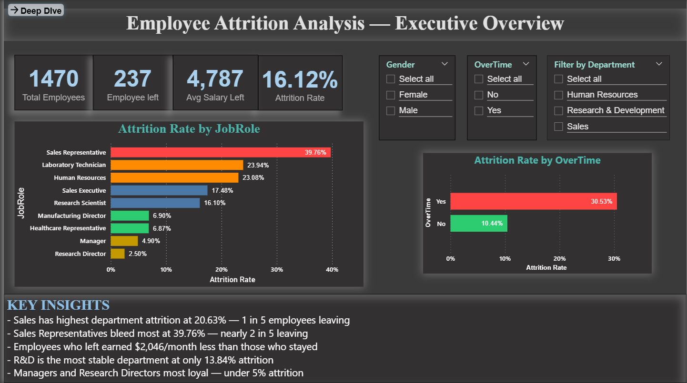
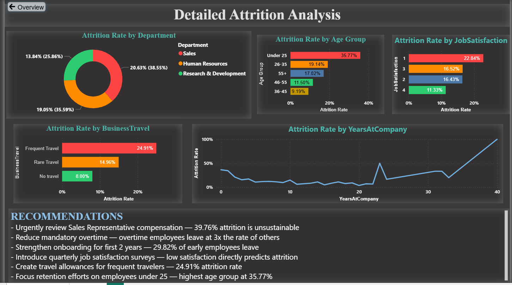

# IBM HR Employee Attrition Analysis

## Project Overview

This project analyzes IBM HR employee attrition data to identify the key factors 
driving employee turnover. The analysis was performed using MySQL for data modeling 
and querying, and Power BI for interactive dashboard visualization.

The goal was to answer the business question:
**"Why are employees leaving, and which groups are most at risk?"**

---

## Tools & Technologies

| Tool | Purpose |
|------|---------|
| MySQL | Database design, normalization, querying |
| Power BI | Interactive dashboard and visualization |
| DAX | Calculated measures and columns |
| Excel | Initial data exploration |

---

## Dataset

- **Source:** [IBM HR Analytics Employee Attrition & Performance](https://www.kaggle.com/datasets/pavansubhasht/ibm-hr-analytics-attrition-dataset)
- **Records:** 1,470 employees
- **Features:** 35 columns covering demographics, job details, compensation, tenure, and satisfaction scores
- **Target Variable:** Attrition (Yes/No)

---

## Database Schema

The original flat CSV was normalized into 5 relational tables using a star schema:
hr_employee_attrition (parent)
├── employee          — Demographics (Age, Gender, Education)
├── job_details       — Role info (Department, JobRole, OverTime)
├── compensation      — Salary data (MonthlyIncome, SalaryHike)
├── tenure            — Experience (YearsAtCompany, YearsWithManager)
└── attrition_status  — Target (Attrition, PerformanceRating)

All tables linked via `EmployeeNumber` as primary key with foreign key constraints.

---

## SQL Techniques Used

- Multi-table JOINs across 5 normalized tables
- Conditional aggregation using `CASE WHEN` inside `SUM()`
- Window functions — `RANK()`, `ROW_NUMBER()`
- Common Table Expressions (CTEs) for cohort analysis
- Subqueries inside window functions
- `GROUP BY`, `HAVING`, `ORDER BY`
- Data type casting and rounding

---

## Key Findings

### Overall
- **16.12% overall attrition rate** — 237 out of 1,470 employees left
- Employees who left earned **$2,046/month less** than those who stayed

### Department & Role
- **Sales has highest department attrition at 20.63%** — 1 in 5 leaving
- **Sales Representatives bleed most at 39.76%** — nearly 2 in 5 leaving
- Managers and Research Directors most loyal — **under 5% attrition**
- R&D most stable department at **13.84%**

### Salary
- Leavers earned **$4,787/month** vs **$6,833** for stayers
- Sales Representatives lowest paid at **$2,626/month** — directly explains high attrition

### Tenure
- **First 2 years are the danger zone** — 29.82% attrition in 0-2 year group
- Year 1 alone has **34.5% attrition** — critical onboarding failure point
- Employees past 2 years drop to 13.82% — loyalty builds with time
- **10+ year employees most loyal at 8.13%**

### Overtime & Satisfaction
- Overtime employees leave at **30.53% vs 10.44%** — 3x higher attrition
- Lowest job satisfaction (score 1) drives **22.84% attrition**
- Worst work-life balance drives **31.25% attrition**

### Age & Travel
- **Under 25 employees highest attrition at 35.77%**
- Frequent travelers at **24.91%** vs non-travelers at **8.00%**

### High Risk Employee Profile
Identified via CTE + multi-table JOIN analysis:
- Young employees (20-40 years) in R&D
- Earning below $4,000/month
- Doing overtime with job satisfaction score of 1
- Leaving within first 2 years of joining

---

## Power BI Dashboard

### Page 1 — Executive Overview

- 4 KPI cards — Total Employees, Employees Left, Avg Salary (Left), Attrition Rate
- Attrition Rate by Job Role — color coded by severity
- Attrition Rate by OverTime
- Interactive slicers — Department, Gender, OverTime
- Key Insights section

### Page 2 — Detailed Analysis

- Attrition Rate by Department (donut chart)
- Attrition Rate by Age Group
- Attrition Rate by Job Satisfaction
- Attrition Rate by Business Travel
- Attrition Rate by Years at Company (trend line)
- Recommendations section

### Dashboard Features
- Color coded severity — Red (high risk) → Orange (medium) → Green (low risk)
- Navigation buttons between pages
- Synced slicers across both pages
- DAX measures for Attrition Rate, Total Employees, Employees Left, Avg Salary

---

## Recommendations

1. **Urgently review Sales Representative compensation** — 39.76% attrition is unsustainable
2. **Reduce mandatory overtime** — overtime employees leave at 3x the rate of others
3. **Strengthen onboarding for first 2 years** — 29.82% of early employees leave
4. **Introduce quarterly job satisfaction surveys** — low satisfaction directly predicts attrition
5. **Create travel allowances for frequent travelers** — 24.91% attrition rate
6. **Focus retention on employees under 25** — highest age group attrition at 35.77%

---

## Project Structure
hr-attrition-analysis/
├── README.md
├── dataset/
│   └── WA_Fn-UseC_-HR-Employee-Attrition.csv
├── sql/
│   ├── 01_creation.sql
│   ├── 02_exploration.sql
│   ├── 03_department_role_analysis.sql
│   ├── 04_salary_analysis.sql
│   ├── 05_tenure_analysis.sql
│   ├── 06_overtime_analysis.sql
│   └── 07_CTE_cohort_analysis.sql
├── dashboard/
│   ├── hr_attrition_dashboard.pbix
│   └── screenshots/
│       ├── page1_overview.png
│       └── page2_detailed.png
└── insights/
└── key_findings.md

---

## Author

**Akhilesh**
- CertNexus Certified Data Analytics Professional
- Skills: Python, MySQL, Power BI, Excel, Pandas, Matplotlib, Seaborn
- [LinkedIn](https://linkedin.com/in/akhilesh-1109ma) | [GitHub](https://github.com/Akhilesh-Mogaveer)

---
