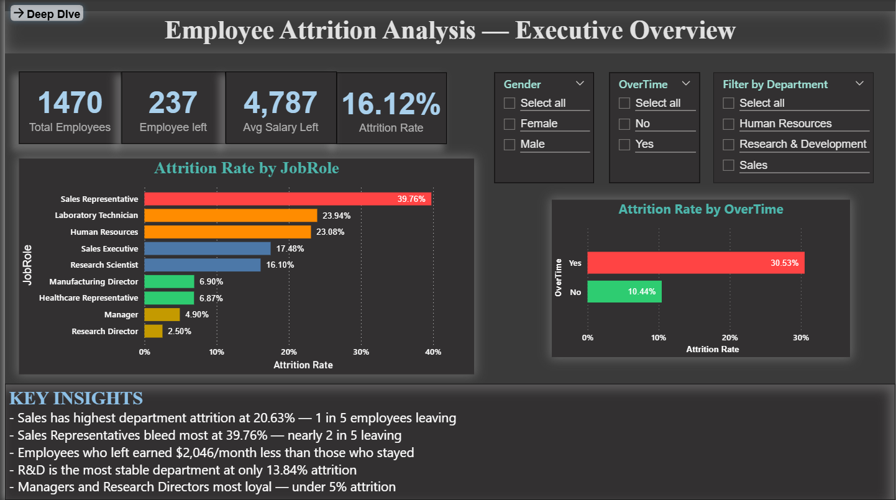
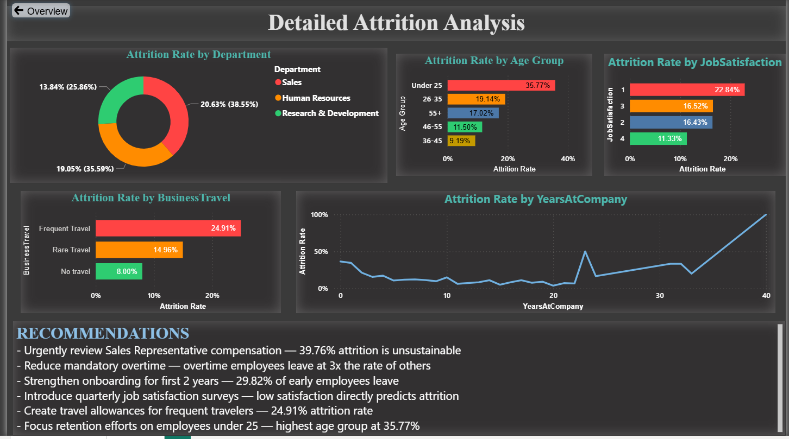

# IBM HR Employee Attrition — End-to-End Analytics & ML Pipeline

## Project Overview

This project analyzes IBM HR employee attrition data to identify the key factors
driving employee turnover — and goes a step further to **predict** which employees
are at risk of leaving. It's built as a complete pipeline: from relational database
design, through business intelligence dashboards, to a deployed machine learning
prediction app.

The project answers two connected business questions:
1. **"Why are employees leaving, and which groups are most at risk?"** (SQL + Power BI)
2. **"Can we predict which individual employees are likely to leave?"** (Python + ML)

**🔗 Live App:** [Employee Attrition Predictor](https://ibm-hr-attrition-predictor.streamlit.app/)

---

## Tools & Technologies

| Tool | Purpose |
|------|---------|
| MySQL | Database design, normalization, querying |
| Power BI / DAX | Interactive dashboard and visualization |
| Python (Pandas, Seaborn, Matplotlib) | Exploratory data analysis |
| scikit-learn | Machine learning modeling |
| Streamlit | Deployed prediction web app |
| Excel | Initial data exploration |

---

## Dataset

- **Source:** [IBM HR Analytics Employee Attrition & Performance](https://www.kaggle.com/datasets/pavansubhasht/ibm-hr-analytics-attrition-dataset)
- **Records:** 1,470 employees
- **Features:** 35 columns covering demographics, job details, compensation, tenure, and satisfaction scores
- **Target Variable:** Attrition (Yes/No)

---

## Part 1: SQL & Database Design

The original flat CSV was normalized into 5 relational tables using a star schema:
```
hr_employee_attrition (parent)
├── employee          — Demographics (Age, Gender, Education)
├── job_details       — Role info (Department, JobRole, OverTime)
├── compensation      — Salary data (MonthlyIncome, SalaryHike)
├── tenure             — Experience (YearsAtCompany, YearsWithManager)
└── attrition_status  — Target (Attrition, PerformanceRating)
```
All tables linked via `EmployeeNumber` as primary key with foreign key constraints.

### SQL Techniques Used
- Multi-table JOINs across 5 normalized tables
- Conditional aggregation using `CASE WHEN` inside `SUM()`
- Window functions — `RANK()`, `ROW_NUMBER()`
- Common Table Expressions (CTEs) for cohort analysis
- Subqueries inside window functions
- `GROUP BY`, `HAVING`, `ORDER BY`
- Data type casting and rounding

---

## Part 2: Power BI Dashboard

### Page 1 — Executive Overview

- 4 KPI cards — Total Employees, Employees Left, Avg Salary (Left), Attrition Rate
- Attrition Rate by Job Role — color coded by severity
- Attrition Rate by OverTime
- Interactive slicers — Department, Gender, OverTime

### Page 2 — Detailed Analysis

- Attrition Rate by Department (donut chart)
- Attrition Rate by Age Group, Job Satisfaction, Business Travel
- Attrition Rate by Years at Company (trend line)

### Key SQL/BI Findings
- **16.12% overall attrition rate** — 237 of 1,470 employees left
- **Sales Representatives bleed most at 39.76%** — lowest paid role at $2,626/month
- **First 2 years are the danger zone** — 29.82% attrition, Year 1 alone at 34.5%
- **Overtime employees leave at 3x the rate** — 30.53% vs 10.44%
- **Under-25 employees highest attrition at 35.77%**
- **High-risk profile:** young R&D employees, <$4,000/month, overtime, low job satisfaction, <2 years tenure

*(Full findings and recommendations in [previous version / analysis notes]).*

---

## Part 3: Python EDA & Machine Learning

Building on the SQL groundwork, the normalized tables were rejoined into a single
flat dataset and analyzed in Python to build a predictive model.

📓 **Notebook:** [`notebooks/IBM_HR_Attrition.ipynb`](notebooks/IBM_HR_Attrition.ipynb)

### Exploratory Data Analysis
- Confirmed ~84/16 class imbalance in Attrition
- Univariate/bivariate analysis on OverTime, Department, Income, Age, Tenure
- Correlation heatmap identifying multicollinearity among tenure-related features

### Preprocessing
- Label encoding for binary fields (Attrition, Gender, OverTime)
- One-hot encoding for nominal categoricals (Department, JobRole, MaritalStatus, EducationField, BusinessTravel)
- Stratified 80/20 train-test split
- Feature standardization (StandardScaler)

### Modeling & Results

| Model | Recall (Attrition) | Precision | ROC-AUC |
|---|---|---|---|
| **Logistic Regression** ✅ | **0.81*** | 0.35 | **0.80** |
| Random Forest (tuned) | 0.34 | 0.44 | 0.78 |
| Gradient Boosting (weighted) | 0.47 | 0.40 | 0.78 |

*\*After tuning the decision threshold from 0.5 → 0.4 to prioritize recall, since missing an at-risk employee is more costly than a false alarm in an HR retention context.*

**Logistic Regression was selected as the final model** — despite being the simplest
of the three, it outperformed both ensemble methods, suggesting attrition drivers in
this dataset are largely linear/additive.

### Top Predictive Features
Feature coefficients revealed the strongest attrition drivers:
- **Increases risk:** OverTime, Frequent Business Travel, Job Role (Lab Technician, Sales Rep), Single marital status
- **Decreases risk:** Total Working Years, Job Role (Research Director)

---

## Part 4: Deployed Prediction App

An interactive Streamlit app lets users input an employee profile and receive a
real-time attrition risk prediction.

**🔗 Live App:** [Employee Attrition Predictor](https://ibm-hr-attrition-predictor.streamlit.app/)
📁 **Source:** [`attrition-app/`](attrition-app/)

**Features:**
- Sidebar inputs for key predictive features (OverTime, Travel, Role, Tenure, etc.)
- Risk probability gauge with color-graded zones
- Dynamic risk/protective factor breakdown based on the trained model's coefficients
- Dark theme matching portfolio branding

---

## Project Structure
```
IBM-HR-Attrition-Analysis/
│
├── README.md
│
├── Data/
│   ├── WA_Fn-UseC_-HR-Employee-Attrition.csv
│   ├── hr_attrition_flat.csv
│   └── normalized/
│       ├── attrition_status.csv
│       ├── compensation.csv
│       ├── employees.csv
│       ├── job_details.csv
│       └── tenure.csv
│
├── SQL/
│   ├── 01_creation.sql
│   ├── 02_exploration.sql
│   ├── 03_department_role_analysis.sql
│   ├── 04_salary_analysis.sql
│   ├── 05_tenure_analysis.sql
│   ├── 06_overtime_analysis.sql
│   └── 07_CTE_cohort_analysis.sql
│
├── Dashboard/
│   ├── IBM-HR-Attrition-Analysis.pbix
│   └── screenshot/
│       ├── Executive_Overview.png
│       └── Detailed_Attrition_Analysis.png
│
├── notebooks/
│   └── IBM_HR_Attrition.ipynb
│
└── attrition-app/
    ├── app.py
    ├── attrition_model.pkl
    ├── requirements.txt
    └── .streamlit/
        └── config.toml
```

## Recommendations (Business)

1. **Urgently review Sales Representative compensation** — 39.76% attrition is unsustainable
2. **Reduce mandatory overtime** — overtime employees leave at 3x the rate of others
3. **Strengthen onboarding for first 2 years** — 29.82% of early employees leave
4. **Introduce quarterly job satisfaction surveys** — low satisfaction directly predicts attrition
5. **Create travel allowances for frequent travelers** — 24.91% attrition rate
6. **Focus retention on employees under 25** — highest age group attrition at 35.77%
7. **Deploy the ML model proactively** — flag high-risk employees (probability ≥ 0.4) for early retention conversations

---

## Author

**Akhilesh**
- CertNexus Certified Data Analytics Professional
- Skills: Python, SQL, Power BI, scikit-learn, Streamlit, Pandas, Matplotlib, Seaborn
- [LinkedIn](https://linkedin.com/in/akhilesh-1109ma) | [GitHub](https://github.com/Akhilesh-Mogaveer)